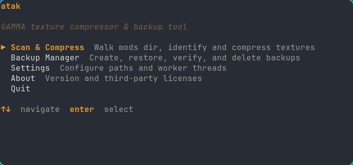
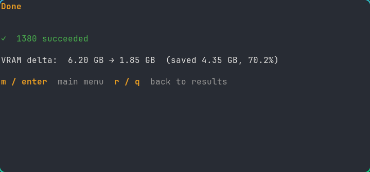

# ATAK — Anomaly Texture Analysis Kit

> Texture compression and backup utility for S.T.A.L.K.E.R. Anomaly modlists.




S.T.A.L.K.E.R. Anomaly and its modpacks represent a labor of love by hundreds of modders, culminating in a unique and memorable gaming experience. However, the ecosystem ships many texture assets uncompressed. On hardware with limited VRAM, this causes stuttering, hitching, and outright crashes during gameplay. ATAK compresses those textures to BCn block compression formats, dramatically reducing VRAM pressure with minimal visual difference.

Works with GAMMA, EFP, and any Anomaly-based modpack.

---

## Download

Grab the latest binary for your platform from [Releases](https://github.com/noisethanks/atak/releases):

| Platform | File |
|---|---|
| Linux x86-64 | `atak-vX.X.X-linux-x64.tar.gz` |
| Windows x86-64 | `atak-vX.X.X-windows-x64.zip` |
| macOS (Intel + Apple Silicon) | `atak-vX.X.X-macos.tar.gz` |

No installation required.

**Linux / macOS:**
```bash
tar -xzf atak-vX.X.X-linux-x64.tar.gz
chmod +x atak-linux
./atak-linux
```

**Windows:** Extract the zip, run `atak-windows.exe` in Windows Terminal or PowerShell.

---

## First time? Start here.

**Back up before you compress. Always.**

1. Launch ATAK and go to **Backup Manager**
2. Create a backup of your Anomaly mods directory — this is your safety net
3. Go to **Scan & Compress**
4. Let it scan your modlist
5. Press **[m]** to compress a single mod first — verify it looks right in game
6. If happy, press **[r]** to compress everything
7. If something looks wrong, restore from backup and try again

Compression is always in-place. Your originals are gone after compression — that's what the backup is for.

---

## What it does

### Backup & Restore
- Create compressed LZMA archives of your full Anomaly mods directory
- Restore individual mods or your entire modlist from backup
- Verify archive integrity

### Scan & Compress
ATAK scans your modlist for uncompressed DDS textures and classifies them by type using filename patterns and directory paths. Only textures explicitly matched by a profile are compressed — nothing is touched blindly.

Default profiles cover the most common texture categories:

| Profile | Format | Detection method |
|---|---|---|
| Normal / bump maps | BC5 | `_bump`, `_normal`, `_nrm`, `_norm` suffixes |
| UI / Icons | BC3 | `textures/ui/` path |
| Diffuse / color | BC3 | `_diff`, `_base`, `_col`, `_d` suffixes |
| Weapon textures | BC3 | `textures/wpn/`, `textures/rwap/` paths |
| Character / hands | BC3 | `textures/act/`, `textures/MK/` paths |
| Sky textures | BC3 | `textures/sky/` path |
| Terrain / detail | BC3 | `textures/terrain/`, `textures/detail/` paths |
| Items | BC3 | `textures/items/`, `textures/item/`, `textures/usable_items/` paths |
| Particle / FX | BC3 | `textures/semitone/` path |

Already-compressed textures (~24,000 in a typical Anomaly install) are detected and skipped automatically.

**Unmatched textures are never touched.** Files that don't match any profile are shown in scan results but excluded from compression. Add patterns to `profiles.json` to include them.

---

## Compression formats

ATAK uses BCn block compression — a GPU-native format that decompresses in hardware with no performance cost. The tradeoff is a small, usually imperceptible quality loss during the compression step.

| Format | Field value | Alpha | Quality | Size | Linux GPU | Best for |
|---|---|---|---|---|---|---|
| BC1 | `BC1_UNORM` | No | Good | 0.5 bpt | Yes | Opaque diffuse, environment |
| BC3 | `BC3_UNORM` | Yes | Good | 1 bpt | Yes | UI, general alpha textures |
| BC5 | `BC5_UNORM` | No | Excellent | 1 bpt | Yes | Normal maps only |
| BC7 | `BC7_UNORM` | Yes | Excellent | 1 bpt | No (CPU) | High quality diffuse, weapons |

*bpt = bytes per texel*

**BC5 is required for normal maps** — using BC3 on normal maps produces incorrect lighting. Do not change the Normal Maps profile format.

**BC7 on Linux** is CPU-only — no GPU acceleration available. Expect 40-60 minutes for large jobs. For faster Linux compression, use BC3 for all profiles (the default). Quality difference is minimal at normal viewing distances.

**Mip chains:** ATAK generates a full mip chain during compression using cubic filtering. This allows the engine to load lower-resolution versions of textures for distant objects, reducing effective VRAM usage further. Keep your in-game texture quality setting at High — lowering it unnecessarily on top of BCn compression will reduce visual quality.

---

## Configuration

Config lives at:
- **Linux:** `~/.config/atak/`
- **Windows:** `%AppData%\atak\`
- **macOS:** `~/Library/Application Support/atak/`

### config.json

Controls tool behavior — paths, workers, backup settings, scan exclusions.

```json
{
  "modsDir": "/path/to/Anomaly/mods",
  "backupDir": "/path/to/backups",
  "workerCount": 1,
  "backupLevel": 6,
  "scanExclusions": [".*", "downloads", "Downloads", "G.A.M.M.A. UI"]
}
```

- `workerCount` — concurrent texconv processes. Each worker pegs one CPU core. Increase only if compression feels slow and your system handles it. Default: 1
- `backupLevel` — 7-Zip compression level 1-9. Default: 6 (balanced). Higher = smaller archive, longer backup time
- `scanExclusions` — directory names to skip entirely during scan. Glob patterns matched against directory name

### profiles.json

Controls which textures get compressed and how. Created on first run from embedded defaults. Edit freely.

```json
{
  "minFileSizeBytes": 1024,
  "excludePatterns": ["fx_sun*", "fx_*", "lut_*"],
  "profiles": [
    {
      "name": "Normal Maps",
      "format": "BC5_UNORM",
      "generateMips": true,
      "maxTextureSize": 0,
      "patterns": ["*_bump.*", "*_normal.*"],
      "exclude": []
    }
  ]
}
```

**Top-level fields:**
- `minFileSizeBytes` — skip files smaller than this. Default: 1024. Protects against stub/placeholder textures that produce artifacts when compressed
- `excludePatterns` — filename glob patterns never compressed regardless of profile match

**Per-profile fields:**
- `name` — display name in scan results
- `format` — compression format. See table above. Use `BC5_UNORM` for normal maps, `BC3_UNORM` for everything else unless you want BC7 quality
- `generateMips` — generate full mip chain during compression. `true` for most textures, `false` for UI (displayed at exact pixel size)
- `maxTextureSize` — cap output resolution. `0` = no limit. Set to `1024` on sky/terrain profiles for 4GB VRAM cards. Textures smaller than this value are not upscaled
- `patterns` — glob patterns matched against filename or full path. Path patterns must contain `/`
- `exclude` — optional per-profile exclusions. Files matching `patterns` but also matching `exclude` are skipped

**Pattern syntax:**
- `*` matches any characters except `/`
- Patterns without `/` match filename only: `*_bump.*` matches `rock_bump.dds`
- Patterns with `/` match full path: `*/textures/wpn/*` matches any file under a `textures/wpn/` directory
- Matching is case-insensitive on all platforms
- **Order matters — first match wins.** Put specific patterns before general ones

---

## Performance

**Note on BC7:** BC7 GPU acceleration is not available on Linux — CPU-only, ~40-60 min for large jobs. Windows benefits from DirectX GPU acceleration. For faster Linux compression, keep all profiles at BC3 (the default).

Benchmarks and feedback welcome — open a GitHub issue or post in the community Discord.

---

## Compression quality

Default profiles use BC3 for all textures except Normal Maps (BC5). BC3 produces minimal visible quality loss at typical Anomaly viewing distances and compresses quickly on all platforms.

For higher quality weapon and character textures, copy `profiles/quality.json` from the repository to your config directory — this uses BC7 for weapons and characters. Recommended for Windows users with GPU acceleration.

For 4GB VRAM cards, set `"maxTextureSize": 1024` on Sky and Terrain profiles in `profiles.json` to reduce VRAM usage further beyond BCn compression.

---

## Known limitations

- BC7 GPU acceleration not available on Linux — CPU fallback, slow on large jobs
- Cancelling a compression job deletes the in-progress file — originals untouched
- 7-Zip backup progress is sparse on large solid archives — the archive is growing even when the progress bar appears stuck
- If the app crashes during backup/restore on Linux, run `pkill 7zz` if you notice high CPU/RAM usage afterwards

---

## Building from source

Requires Go 1.21+.

```bash
git clone https://github.com/noisethanks/atak
cd atak
go build -o atak-linux .
```

Release build:
```bash
CGO_ENABLED=0 GOOS=linux GOARCH=amd64 go build \
  -ldflags="-s -w -X main.version=v0.1.0" \
  -o atak-linux .
```

---

## GAMMA

[S.T.A.L.K.E.R. GAMMA](https://www.stalkergamma.com/) is a large modpack
for S.T.A.L.K.E.R. Anomaly maintained by Grok. Join the community on
[Discord](https://discord.com/invite/stalker-gamma).

---

## Attributions

- [texconv (Texconv-Custom-DLL)](https://github.com/matyalatte/Texconv-Custom-DLL) — MIT — matyalatte
- [7-Zip](https://www.7-zip.org) — LGPL v2.1 — Igor Pavlov
- [Bubble Tea](https://github.com/charmbracelet/bubbletea) — MIT — Charmbracelet
- [Bubbles](https://github.com/charmbracelet/bubbles) — MIT — Charmbracelet
- [Lip Gloss](https://github.com/charmbracelet/lipgloss) — MIT — Charmbracelet

Full license text available in-app via the About screen.

---

## Support

If ATAK saved your playthrough, consider supporting development:

**[noisethanks.com/support](https://noisethanks.com/support)**

Made by [mrchocolate](https://github.com/noisethanks)
